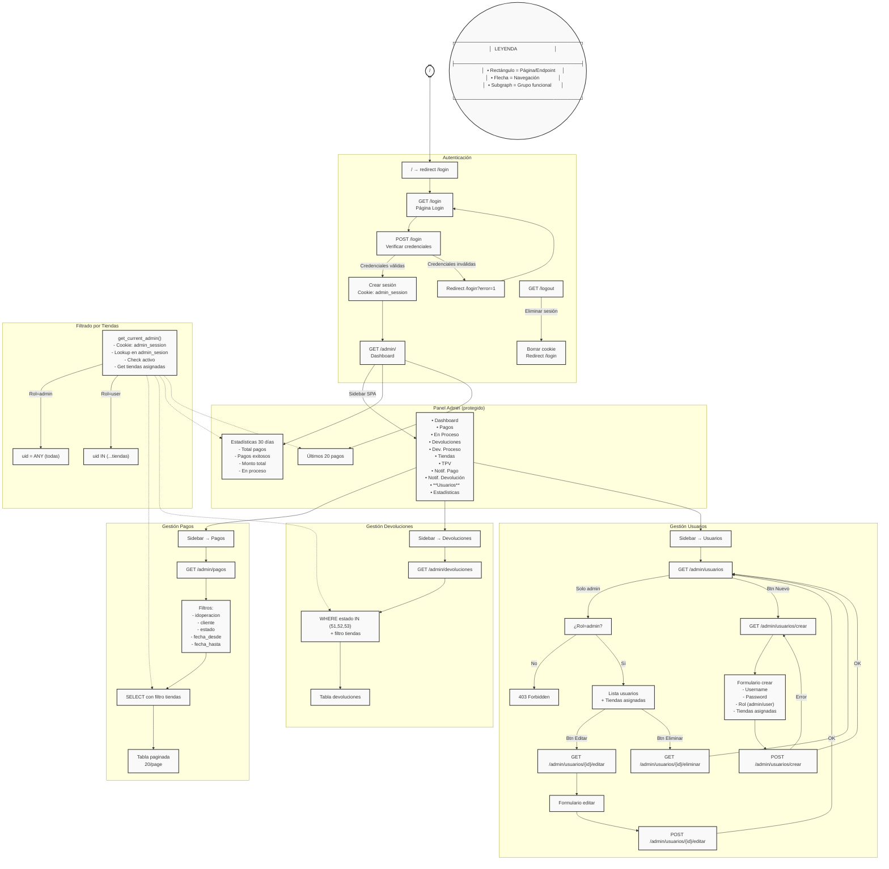
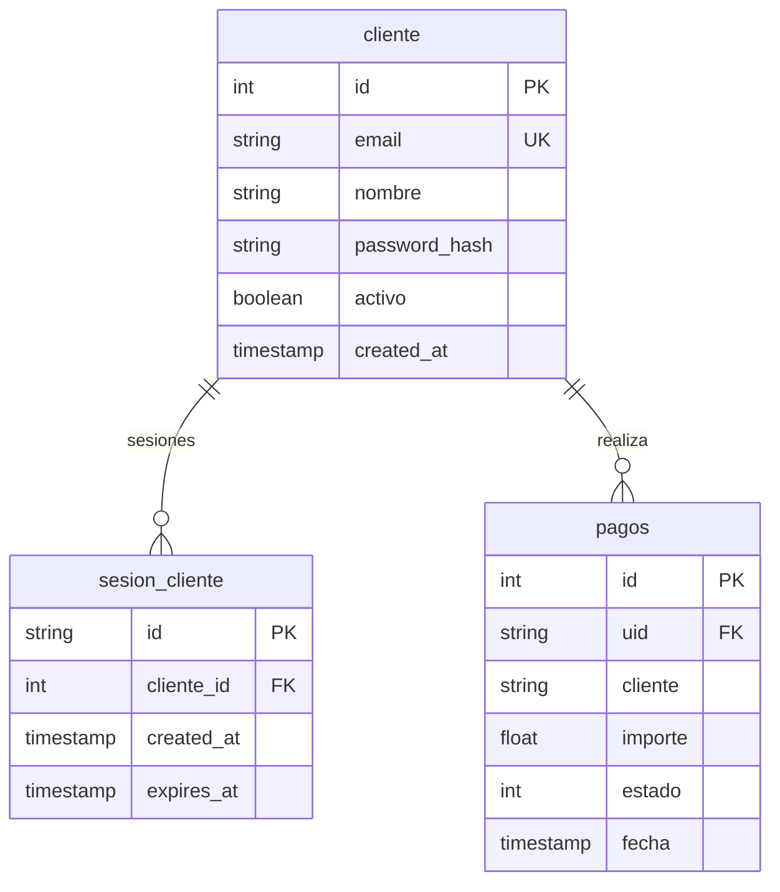

# Documentación Técnica - Pasarela de Pagos

## 1. Arquitectura General

### 1.1 Stack Tecnológico
- **Framework**: FastAPI + Uvicorn
- **ORM**: SQLAlchemy 2.0
- **Driver DB**: asyncpg (PostgreSQL asíncrono)
- **Templates**: Jinja2
- **Validación**: Pydantic v2

### 1.2 Estructura del Proyecto
```
pasarela/web/
├── main.py              # Punto de entrada, configuración FastAPI
├── database.py         # Conexión y operaciones DB
├── models.py          # Modelos Pydantic (request/response)
├── models/
│   └── modelos.py    # Modelos Extended para pagos
├── routers/
│   ├── pagos_admin.py  # Endpoints admin (pagos, devoluciones)
│   ├── tiendas.py      # Gestión tiendas y TPV
│   ├── estadisticas.py # Dashboard estadísticas
│   ├── cliente.py     # Portal cliente
│   ├── admin_auth.py  # Autenticación admin
│   └── admin_usuarios.py # CRUD usuarios admin
├── comun/
│   ├── funciones.py  # Utilidades (generación IDs, errores)
│   └── log.py        # Sistema de logs
├── templates/        # Plantillas Jinja2
├── static/css/       # Estilos
├── log/             # Archivos de log
└── doc/             # Documentación
```

### 1.3 Flujo de Navegación - Diagrama Mermaid



### 1.4 Modelo de Datos - Sistema Admin

```mermaid
erDiagram
    admin_usuario ||--o{ admin_usuario_tienda : "asignaciones"
    tiendas ||--o{ admin_usuario_tienda : "asignada_a"
    tiendas ||--o{ admin_usuario_tienda : "para_usuario"
    admin_usuario ||--o{ admin_sesion : "tiene"

    admin_usuario {
        int id PK
        string username UK
        string password_hash
        string rol "admin|user"
        boolean activo
        timestamp created_at
    }

    admin_usuario_tienda {
        int usuario_id FK
        string tienda_uid FK
        PRIMARY KEY(usuario_id, tienda_uid)
    }

    tiendas {
        string uid PK
        string nombre
        string produccion
        string desarrollo
        boolean activa
    }

    admin_sesion {
        string id PK
        int usuario_id FK
        timestamp created_at
        timestamp expires_at
    }
```

### 1.5 Modelo de Datos - Sistema Cliente



### 1.3 Configuración
Variables de entorno en `.env`:
```
DB_HOST=localhost
DB_PORT=5432
DB_USER=postgres
DB_PASSWORD=1234
DB_NAME=pasarela
```

---

## 2. Base de Datos

### 2.1 Tablas Principales
| Tabla | Descripción |
|-------|-------------|
| `tiendas` | Tiendas registradas |
| `tpv` | Terminales de punto de venta |
| `pagos` | Operaciones de pago |
| `url` | URLs de callback |
| `msg` | Mensajes del sistema |
| `devolucion` | Devoluciones |
| `notificacion_pago` | Notificaciones de pago recibidas |
| `notificacion_devolucion` | Notificaciones de devolución |

### 2.2 Tablas de Usuario Admin
| Tabla | Descripción |
|-------|-------------|
| `admin_usuario` | Usuarios administradores |
| `admin_usuario_tienda` | Relación usuario-tienda |
| `admin_sesion` | Sesiones activas admin |

### 2.3 Tablas Portal Cliente
| Tabla | Descripción |
|-------|-------------|
| `cliente` | Clientes del portal |
| `sesion_cliente` | Sesiones de cliente |

### 2.4 Estados de Pago
| Código | Nombre | Descripción |
|--------|--------|-------------|
| 0 | Pendiente | Inicial |
| 11 | Cancelada | Cancelada por usuario |
| 14 | Duplicada | Duplicada |
| 15 | En Proceso | Enviada a processor |
| 18 | Notificada | Notificada al comercio |
| 50 | No Enviada | No enviada aún |
| 51 | Aceptada | Aceptada por banco |
| 52 | No Aceptada | Rechazada |
| 53 | Notificada | Notificación confirmada |
| 54 | Vencida | Tiempo expirado |
| 55 | No Existe | Orden no existe |
| 500 | Error | Error interno |

---

## 3. API Endpoints

### 3.1 Autenticación Admin (prefijo: `/`)

| Método | Ruta | Descripción |
|--------|-----|-------------|
| GET | `/` | Redirige a `/login` |
| GET | `/login` | Página de login |
| POST | `/login` | Autenticar usuario admin |
| GET | `/logout` | Cerrar sesión admin |

### 3.2 Administración (prefijo: `/admin`)

| Método | Ruta | Descripción |
|--------|-----|-------------|
| GET | `/` | Dashboard principal |
| GET | `/pagos` | Listar pagos con filtros |
| GET | `/pagos/{id}` | Ver detalle de pago (API JSON) |
| GET | `/pagos/{id}/editar` | Formulario editar pago |
| POST | `/pagos/{id}/editar` | Actualizar pago |
| GET | `/pagos/proceso` | Pagos en proceso (estado=50) |
| GET | `/devoluciones` | Listar devoluciones |
| GET | `/devoluciones/proceso` | Devoluciones pendientes |
| GET | `/notificaciones` | Notificaciones de pago |
| GET | `/notificaciones/devolucion` | Notificaciones de devolución |
| GET | `/tiendas` | Listar tiendas |
| POST | `/tiendas` | Crear tienda |
| GET | `/tiendas/{uid}/editar` | Editar tienda |
| POST | `/tiendas/{uid}/editar` | Actualizar tienda |
| DELETE | `/tiendas/{uid}` | Eliminar tienda |
| GET | `/tpv` | Listar TPVs |
| POST | `/tpv` | Crear TPV |
| GET | `/tpv/{id}/editar` | Editar TPV |
| POST | `/tpv/{id}/editar` | Actualizar TPV |
| DELETE | `/tpv/{id}` | Eliminar TPV |
| GET | `/estadisticas` | Dashboard estadísticas |
| **GET** | **`/usuarios`** | **Listar usuarios admin** |
| **GET** | **`/usuarios/crear`** | **Formulario crear usuario** |
| **POST** | **`/usuarios/crear`** | **Crear usuario** |
| **GET** | **`/usuarios/{id}/editar`** | **Formulario editar usuario** |
| **POST** | **`/usuarios/{id}/editar`** | **Actualizar usuario** |
| **GET** | **`/usuarios/{id}/eliminar`** | **Eliminar usuario** |

### 3.3 Portal Cliente (prefijo: `/portal`)

| Método | Ruta | Descripción |
|--------|-----|-------------|
| GET | `/login` | Página login cliente |
| POST | `/login` | Autenticar cliente |
| POST | `/logout` | Cerrar sesión |
| GET | `/` | Dashboard cliente |
| GET | `/pagos` | Mis pagos |
| GET | `/pagos/{id}` | Detalle pago |
| GET | `/devoluciones` | Mis devoluciones |

---

## 4. Modelos de Datos

### 4.1 Request Models (models/modelos.py)

```python
# Solicitud de pago síncrono (PCPOS)
SolicitudPagoRequest:
  - Amount: float (importe, >0)
  - Phone: str (ID TPV, max 10)
  - Currency: str (CUP|CUC|USD|EUR)
  - Description: str
  - ExternalId: str (formato: UID-IDOPERACION)
  - Source: str
  - ValidTime: str (segundos)
  - UrlResponse: str

# Solicitud de pago asíncrono
SolicitudPagoAsincRequest:
  - Same as above but UrlResponse es requerida para callback
  - No retorna respuesta inmediata

# Notificación de pago
NotificacionRequest:
  - Phone, ExternalId, TmId, BankId
  - Status, Source, Msg, Bank

# Devolución
DevolucionRequest:
  - RefundID: str (formato: UID-IDOPERACION)
  - Source, Code, UrlResponse, Bank
  - importe: float (opcional)
```

### 4.2 Response Models

```python
SolicitudPagoResponse:
  - ExternalId, Estado, Msg
  - Notificacion: Optional[Dict]

DevolucionResponse:
  - Estado, Msg, ETECSA: Optional[Dict]

CancelarResponse:
  - Estado, Error: Optional[str]

NotificacionResponse:
  - Success, Resultmsg, Status
```

---

## 5. Módulos Comunes

### 5.1 comun/log.py
- `traza(texto)`: Registra traza de operaciones
- `get_logpath()`: Obtiene directorio de logs
- `get_errorfile()`: Archivo de errores diario

### 5.2 comun/funciones.py
- `id_keygen(size, chars)`: Genera ID aleatorio
- `id_numgen(size, chars)`: Genera número aleatorio
- `id_alfagen(size, chars)`: Genera ID alfanumérico
- `id_traza_gen()`: Genera ID de traza
- `valida_campos(idtraza, campos, data)`: Valida campos requeridos
- `ver_error(texto)`: Registra excepción en archivo
- `_hash(txt)`: Hash SHA256

---

## 6. Inicialización

### 6.1 Lifespan (main.py)
```python
@asynccontextmanager
async def lifespan(app: FastAPI):
    # 1. Conectar a DB
    await db.connect()
    
    # 2. Crear directorios templates
    os.makedirs(...)
    
    # 3. Inicializar tablas cliente
    await db.init_cliente_tables()
    
    # 4. Inicializar tablas notificaciones
    await db.init_notificaciones_tables()
    
    # 5. Inicializar tablas admin
    await db.init_admin_tables()
    
    # 6. Crear usuario admin inicial
    await db.crear_admin_inicial()
    
    yield
    
    # 7. Cerrar conexiones
    await db.close()
```

### 6.2 Tablas Creadas Automáticamente
**Cliente:**
- `cliente` - Usuarios del portal
- `sesion_cliente` - Sesiones activas

**Admin:**
- `admin_usuario` - Usuarios administradores
- `admin_usuario_tienda` - Relación usuario-tienda
- `admin_sesion` - Sesiones activas admin

**Notificaciones:**
- `notificacion_pago` - Notificaciones de pago
- `notificacion_devolucion` - Notificaciones de devolución

---

## 7. Ejecución

### 7.1 Desarrollo
```bash
python main.py
# o
uvicorn main:app --host 0.0.0.0 --port 8000 --reload
```

### 7.2 Producción
```bash
uvicorn main:app --host 0.0.0.0 --port 8000 --workers 4
```

---

## 8. Dependencias

Las dependencias se encuentran en `/comp/` (no pip):
- fastapi
- uvicorn
- sqlalchemy
- asyncpg
- pydantic
- jinja2
- python-dotenv

---

*Documento generado automáticamente - Pasarela Web v1.0*